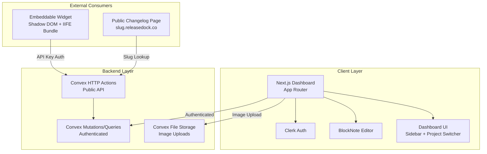
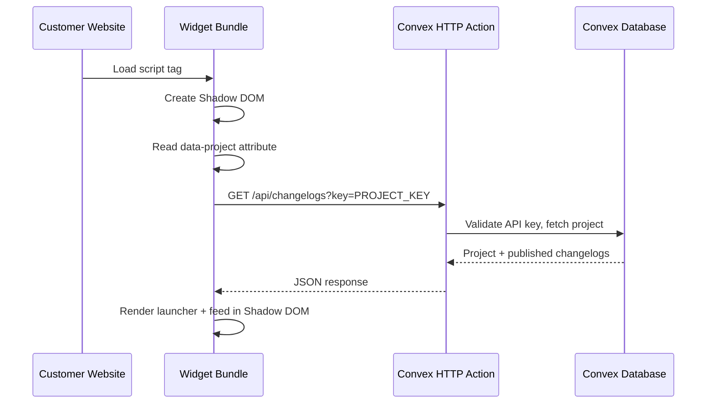
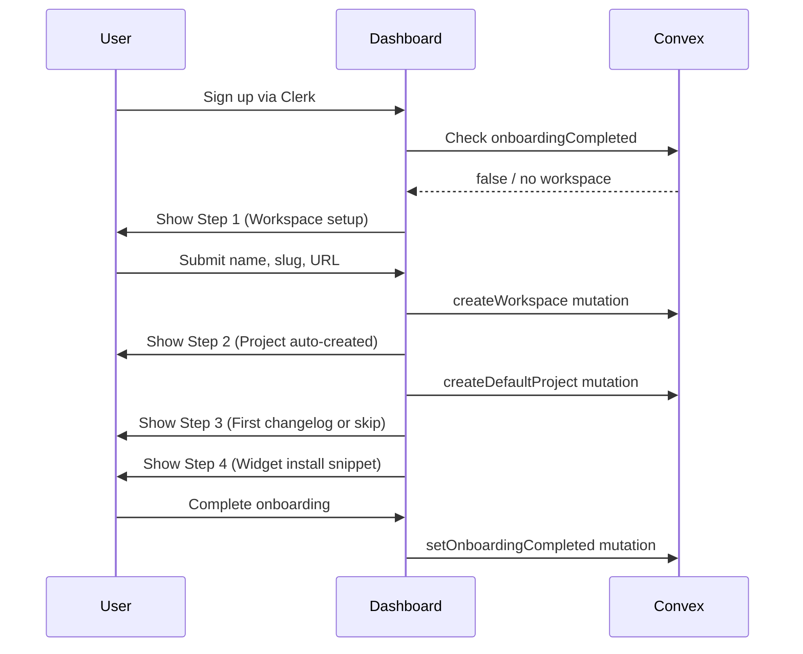
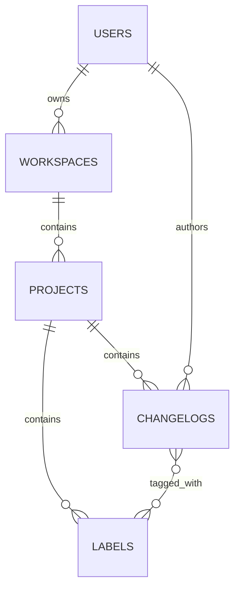

# Design Document: ReleaseDock Changelog SaaS Platform

## Overview

ReleaseDock is a SaaS changelog platform built on Next.js 16 (App Router), Convex backend, Clerk authentication, and Tailwind v4. The system consists of four major subsystems:

1. **Dashboard Application** — The authenticated Next.js app where users manage workspaces, projects, changelogs, and settings. Includes a multi-step onboarding flow and a BlockNote-based rich text editor.
2. **Convex Backend** — Schema, mutations, queries, and HTTP actions powering all data operations, including public API endpoints for the widget.
3. **Embeddable Widget** — A separate IIFE JavaScript bundle (~40-50KB gzipped) that renders inside a Shadow DOM container on customer websites, fetching changelogs via the public API.
4. **Public Changelog Pages** — Server-rendered pages at `{slug}.releasedock.co` subdomains displaying published changelogs.

### Key Design Decisions

- **BlockNote for rich text**: Provides a Notion-like editing experience with slash commands, drag handles, and block-based editing out of the box. Content is stored as BlockNote JSON (an array of block objects).
- **Shadow DOM for widget isolation**: Industry-standard approach (used by Beamer, AnnounceKit) ensuring widget CSS never leaks into or is affected by the host site.
- **Convex HTTP Actions for public API**: Convex's built-in HTTP action support provides serverless endpoints with direct database access, avoiding the need for a separate API server.
- **Subdomain-based routing**: `{slug}.releasedock.co` uses wildcard DNS + Next.js middleware to resolve workspaces by slug, following the professional SaaS standard.

## Architecture



### Request Flow: Widget



### Request Flow: Onboarding



## Components and Interfaces

### 1. Convex Backend Components

#### Schema & Mutations (`convex/`)

| Module | Purpose |
|--------|---------|
| `schema.ts` | Extended schema with workspaces, projects, changelogs, labels tables |
| `users.ts` | Existing user sync + onboarding status queries |
| `workspaces.ts` | CRUD operations, slug validation, workspace lookup by slug |
| `projects.ts` | CRUD operations, API key generation/regeneration, widget settings |
| `changelogs.ts` | CRUD operations, status transitions, filtered queries, label associations |
| `labels.ts` | CRUD operations, duplicate prevention, cascade cleanup |
| `http.ts` | HTTP actions for public API (changelog fetch, CORS) |
| `storage.ts` | File upload mutation for image handling |

#### Key Interfaces

```typescript
// Workspace creation args
interface CreateWorkspaceArgs {
  name: string;
  slug: string;       // validated: lowercase, alphanumeric + hyphens, unique
  websiteUrl: string;
}

// Project creation args
interface CreateProjectArgs {
  workspaceId: Id<"workspaces">;
  name: string;
  // API key auto-generated server-side
}

// Changelog creation/update args
interface UpsertChangelogArgs {
  projectId: Id<"projects">;
  title: string;
  content: any;        // BlockNote JSON blocks
  status: "draft" | "published";
  labelIds: Id<"labels">[];
}

// Widget settings
interface WidgetSettings {
  primaryColor: string;
  position: "bottom-right" | "bottom-left";
  showBranding: boolean;
}

// Public API response
interface PublicChangelogResponse {
  entries: Array<{
    title: string;
    content: any;       // BlockNote JSON
    publishDate: number;
    labels: Array<{ name: string; color: string }>;
  }>;
  widgetSettings: WidgetSettings;
}
```

### 2. Dashboard Components (`app/`)

| Route / Component | Purpose |
|-------------------|---------|
| `app/onboarding/` | Multi-step onboarding wizard (Steps 1-4) |
| `app/dashboard/` | Main dashboard layout with sidebar |
| `app/dashboard/changelogs/` | Changelog list view with status filters |
| `app/dashboard/changelogs/[id]/` | Changelog editor page (BlockNote) |
| `app/dashboard/changelogs/new/` | New changelog creation page |
| `app/dashboard/settings/widget/` | Widget theming and embed code |
| `app/dashboard/settings/api-keys/` | API key view and regeneration |
| `app/dashboard/settings/labels/` | Label management |
| `components/Sidebar.jsx` | Persistent sidebar navigation |
| `components/ProjectSwitcher.jsx` | Project dropdown switcher |
| `components/ChangelogEditor.jsx` | BlockNote editor wrapper |
| `components/StatusFilter.jsx` | Draft/published filter tabs |

#### Onboarding Flow Component Structure

```typescript
// Step management
interface OnboardingState {
  currentStep: 1 | 2 | 3 | 4;
  workspaceId?: Id<"workspaces">;
  projectId?: Id<"projects">;
}

// Step 1: Workspace setup form
// Step 2: Auto-project creation (progress indicator)
// Step 3: Editor or skip button
// Step 4: Embed snippet display with copy button
```

### 3. Widget Components (`widget/`)

The widget is a separate build artifact, not part of the Next.js app.

| File | Purpose |
|------|---------|
| `widget/src/index.ts` | Entry point: reads config, creates Shadow DOM, mounts React app |
| `widget/src/App.tsx` | Root widget component |
| `widget/src/Launcher.tsx` | Floating button with unread badge |
| `widget/src/Feed.tsx` | Changelog feed popup/sidebar |
| `widget/src/api.ts` | Fetch client for Convex HTTP actions |
| `widget/src/storage.ts` | localStorage wrapper for last-visit tracking |
| `widget/src/styles.css` | Widget styles (injected into Shadow DOM) |
| `widget/vite.config.ts` | Vite config for IIFE bundle output |

#### Widget Initialization Flow

```typescript
// 1. Script loads, finds its own script tag
// 2. Reads data-project attribute
// 3. Creates Shadow DOM container on document.body
// 4. Injects styles into Shadow DOM
// 5. Renders React app into Shadow DOM
// 6. Fetches changelogs from public API
// 7. Sets up window.ReleaseDock API
// 8. Attaches click listeners to [data-releasedock-changelog] elements

interface ReleaseDockAPI {
  open(): void;
  close(): void;
  markAsRead(): void;
}
```

### 4. Public Changelog Page

Uses Next.js middleware to extract the subdomain slug, then renders a server-side page.

| File | Purpose |
|------|---------|
| `middleware.ts` | Extracts subdomain slug, rewrites to internal route |
| `app/changelog/[slug]/page.tsx` | Server component fetching and rendering public changelogs |
| `components/ChangelogRenderer.tsx` | Read-only BlockNote JSON to HTML renderer |

## Data Models

### Convex Schema

```typescript
import { defineSchema, defineTable } from "convex/server";
import { v } from "convex/values";

export default defineSchema({
  users: defineTable({
    clerkId: v.string(),
    email: v.string(),
    name: v.optional(v.string()),
    imageUrl: v.optional(v.string()),
    onboardingCompleted: v.optional(v.boolean()),
  }).index("by_clerk_id", ["clerkId"]),

  workspaces: defineTable({
    name: v.string(),
    slug: v.string(),
    websiteUrl: v.string(),
    ownerId: v.id("users"),
    createdAt: v.number(),
  })
    .index("by_slug", ["slug"])
    .index("by_owner", ["ownerId"]),

  projects: defineTable({
    workspaceId: v.id("workspaces"),
    name: v.string(),
    apiKey: v.string(),
    widgetSettings: v.object({
      primaryColor: v.string(),
      position: v.union(v.literal("bottom-right"), v.literal("bottom-left")),
      showBranding: v.boolean(),
    }),
    createdAt: v.number(),
  })
    .index("by_workspace", ["workspaceId"])
    .index("by_api_key", ["apiKey"]),

  changelogs: defineTable({
    projectId: v.id("projects"),
    title: v.string(),
    content: v.any(),  // BlockNote JSON blocks
    status: v.union(v.literal("draft"), v.literal("published")),
    publishDate: v.optional(v.number()),
    labelIds: v.array(v.id("labels")),
    authorId: v.id("users"),
    createdAt: v.number(),
    updatedAt: v.number(),
  })
    .index("by_project", ["projectId"])
    .index("by_project_status", ["projectId", "status"]),

  labels: defineTable({
    projectId: v.id("projects"),
    name: v.string(),
    color: v.string(),
  }).index("by_project", ["projectId"]),
});
```

### Entity Relationships



### API Key Generation

API keys are generated server-side using a cryptographically random string:

```typescript
// Format: "rd_" prefix + 32 random hex characters
// Example: "rd_a1b2c3d4e5f6a7b8c9d0e1f2a3b4c5d6"
function generateApiKey(): string {
  const bytes = crypto.getRandomValues(new Uint8Array(16));
  const hex = Array.from(bytes).map(b => b.toString(16).padStart(2, '0')).join('');
  return `rd_${hex}`;
}
```

### Slug Validation Rules

```typescript
// Must match: lowercase letters, numbers, hyphens
// Must not start or end with a hyphen
// Length: 3-63 characters
const SLUG_REGEX = /^[a-z0-9]([a-z0-9-]{1,61}[a-z0-9])?$/;

// Reserved slugs (cannot be used)
const RESERVED_SLUGS = ["www", "api", "app", "admin", "cdn", "mail", "help", "support", "status"];
```


## Correctness Properties

*A property is a characteristic or behavior that should hold true across all valid executions of a system — essentially, a formal statement about what the system should do. Properties serve as the bridge between human-readable specifications and machine-verifiable correctness guarantees.*

### Property 1: Slug validation accepts only valid formats

*For any* string, the slug validation function should accept it if and only if it is lowercase, contains only alphanumeric characters and hyphens, does not start or end with a hyphen, is 3-63 characters long, and is not a reserved slug.

**Validates: Requirements 1.2**

### Property 2: Workspace creation persists all required fields

*For any* valid workspace creation input (name, slug, website URL), after creating the workspace, querying it by slug should return a record containing the same name, slug, website URL, a valid owner reference, and a creation timestamp.

**Validates: Requirements 1.5, 4.2**

### Property 3: API key uniqueness

*For any* set of projects created across any number of workspaces, all generated API keys should be distinct from one another.

**Validates: Requirements 2.1**

### Property 4: Project creation persists all required fields

*For any* valid project creation input, after creating the project, querying it should return a record containing the project name, a non-empty API key, the correct workspace reference, and default widget settings.

**Validates: Requirements 2.2, 4.3**

### Property 5: API key regeneration produces a different key

*For any* project, regenerating its API key should produce a key that is different from the previous key.

**Validates: Requirements 2.3**

### Property 6: Widget settings round-trip

*For any* valid widget settings (primaryColor, position, showBranding), updating a project's widget settings and then reading them back should return identical values.

**Validates: Requirements 2.4**

### Property 7: Label creation requires name and color

*For any* label creation attempt, the operation should succeed only when both a non-empty name and a non-empty color are provided, and the label should be associated with the specified project.

**Validates: Requirements 3.1**

### Property 8: Label name uniqueness per project

*For any* project and any label name, creating a second label with the same name within the same project should be rejected, while creating a label with the same name in a different project should succeed.

**Validates: Requirements 3.2**

### Property 9: Label deletion cascades to changelogs

*For any* label that is referenced by one or more changelog entries, after deleting that label, none of those changelog entries should contain the deleted label's ID in their labelIds array.

**Validates: Requirements 3.3**

### Property 10: Onboarding routing based on completion flag

*For any* authenticated user, the routing decision should direct the user to the onboarding flow if and only if the onboardingCompleted flag is not true.

**Validates: Requirements 4.1, 4.7**

### Property 11: Embed snippet contains project API key

*For any* project, the generated embed snippet string should contain that project's API key as the `data-project` attribute value.

**Validates: Requirements 4.5**

### Property 12: Onboarding completion sets flag

*For any* user completing the onboarding flow, after completion the onboardingCompleted flag on the user record should be true.

**Validates: Requirements 4.6**

### Property 13: Project switching scopes changelog data

*For any* workspace with multiple projects, after switching to a specific project, all returned changelog entries should belong to that project and no entries from other projects should be included.

**Validates: Requirements 5.3**

### Property 14: Changelog status filter correctness

*For any* project and status filter value (draft or published), all returned changelog entries should have a status matching the filter, and no entries with a non-matching status should be included.

**Validates: Requirements 6.1, 6.2**

### Property 15: Changelog save persists all fields

*For any* valid changelog save operation (title, content, status, labels, author), querying the saved changelog should return a record with identical title, content, status, labelIds, and authorId.

**Validates: Requirements 6.3, 6.4**

### Property 16: Publishing sets status and records date

*For any* draft changelog entry, after publishing it, the status should be "published" and the publishDate should be a valid timestamp.

**Validates: Requirements 6.5**

### Property 17: Editing a published changelog preserves publish date

*For any* published changelog entry with a known publishDate, after editing its title, content, or labels, the publishDate should remain unchanged.

**Validates: Requirements 6.6**

### Property 18: Unread badge count matches changelogs after last visit

*For any* set of published changelog entries and a last-visit timestamp, the unread count should equal the number of entries whose publishDate is strictly greater than the last-visit timestamp.

**Validates: Requirements 8.6**

### Property 19: Public API returns published changelogs with required fields, ordered by date descending

*For any* project with a mix of draft and published changelogs, a valid API request should return only published entries, each containing title, content, publishDate, and labels, and the entries should be ordered by publishDate descending.

**Validates: Requirements 9.1, 9.3**

### Property 20: Invalid API key returns 401

*For any* string that does not match a valid project API key, a request to the public API with that string should receive a 401 status response.

**Validates: Requirements 9.2**

### Property 21: Public page resolves slug and renders all published changelogs

*For any* valid workspace slug, the public changelog page should display all published changelog entries for that workspace, each rendered with title, publishDate, labels, and rich text content.

**Validates: Requirements 10.1, 10.2**

### Property 22: Public page displays changelogs ordered by publish date descending

*For any* workspace with multiple published changelogs, the public changelog page should display them in descending order of publishDate.

**Validates: Requirements 10.3**

### Property 23: BlockNote JSON round-trip

*For any* valid BlockNote JSON document, serializing then deserializing then serializing again should produce an identical JSON output.

**Validates: Requirements 7.5, 7.6, 11.1, 11.2, 11.3**

### Property 24: BlockNote JSON to HTML rendering preserves content

*For any* valid BlockNote JSON document, rendering it to read-only HTML should produce output containing all text content present in the original JSON blocks.

**Validates: Requirements 11.4**

## Error Handling

### Input Validation Errors

| Error Condition | Handling |
|----------------|----------|
| Invalid slug format | Return descriptive error: "Slug must be 3-63 lowercase alphanumeric characters or hyphens, and cannot start/end with a hyphen" |
| Duplicate slug | Return error: "This URL is already taken. Please choose a different one." |
| Duplicate label name | Return error: "A label with this name already exists in this project." |
| Empty required fields | Return field-specific validation errors |
| Invalid widget settings | Return error with valid options for position and color format |

### Authentication & Authorization Errors

| Error Condition | Handling |
|----------------|----------|
| Unauthenticated dashboard access | Clerk middleware redirects to sign-in page |
| Invalid API key on public API | Return 401 with `{ error: "Unauthorized" }` |
| Missing API key on public API | Return 401 with `{ error: "API key required" }` |
| User accessing another user's workspace | Convex mutation/query checks ownership, returns 403 |

### Data Integrity Errors

| Error Condition | Handling |
|----------------|----------|
| Label deletion with references | Cascade remove label ID from all referencing changelogs before deleting |
| Project deletion | Cascade delete all changelogs and labels for the project |
| Image upload failure | Return error to editor, block is not inserted, user can retry |
| Convex mutation failure | Client-side error boundary displays retry option |

### Widget Errors

| Error Condition | Handling |
|----------------|----------|
| Invalid data-project attribute | Widget logs warning to console, does not render |
| API fetch failure | Widget shows "Unable to load updates" message in feed, retries with exponential backoff |
| Shadow DOM not supported | Widget falls back to a regular div container with scoped styles |
| localStorage unavailable | Widget functions without unread tracking, badge always shows 0 |

### Public Page Errors

| Error Condition | Handling |
|----------------|----------|
| Unknown slug | Return 404 page with "Changelog not found" message |
| No published changelogs | Display empty state: "No updates yet. Check back soon." |

## Testing Strategy

### Testing Framework

- **Unit & Integration Tests**: Vitest (already compatible with the Next.js ecosystem)
- **Property-Based Tests**: fast-check (JavaScript/TypeScript PBT library, integrates with Vitest)
- **Component Tests**: React Testing Library with Vitest
- **Convex Tests**: Convex test helpers with in-memory database

### Property-Based Testing Configuration

Each property-based test must:
- Use `fast-check` with `fc.assert` and `fc.property`
- Run a minimum of 100 iterations (`{ numRuns: 100 }`)
- Reference its design document property in a comment tag
- Tag format: `// Feature: changelog-saas-platform, Property N: [property text]`
- Each correctness property maps to exactly one property-based test

### Unit Testing Strategy

Unit tests complement property tests by covering:
- Specific examples that demonstrate correct behavior (e.g., a known-good slug "my-app" passes validation)
- Edge cases (e.g., slug with leading hyphen, empty string, reserved slugs)
- Error conditions (e.g., duplicate slug, invalid API key format)
- Integration points (e.g., Clerk webhook triggers user sync)

Avoid writing excessive unit tests for scenarios already covered by property tests. Property tests handle broad input coverage; unit tests pin down specific known behaviors.

### Test Organization

```
tests/
├── unit/
│   ├── slug-validation.test.ts
│   ├── api-key-generation.test.ts
│   ├── unread-count.test.ts
│   └── changelog-filters.test.ts
├── properties/
│   ├── slug-validation.property.test.ts
│   ├── workspace-persistence.property.test.ts
│   ├── api-key-uniqueness.property.test.ts
│   ├── label-management.property.test.ts
│   ├── changelog-management.property.test.ts
│   ├── public-api.property.test.ts
│   ├── blocknote-roundtrip.property.test.ts
│   └── unread-count.property.test.ts
├── integration/
│   ├── onboarding-flow.test.ts
│   ├── widget-initialization.test.ts
│   └── public-page.test.ts
```

### Key Testing Priorities

1. **Data integrity**: Slug validation, API key uniqueness, label cascade deletion, changelog persistence
2. **Serialization**: BlockNote JSON round-trip (critical for data fidelity)
3. **API correctness**: Public API authentication, response shape, ordering
4. **Business logic**: Status transitions, unread count calculation, onboarding flow state machine
5. **Widget isolation**: Shadow DOM creation, attribute reading, API surface
